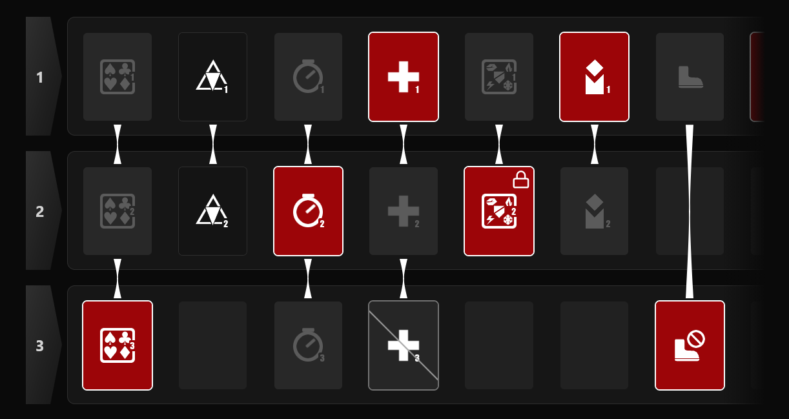

# CC Randomizer

A community tool for generating randomized Contingency Contract Risk codes for **Arknights: Endfield**.

<!--  -->

todo: [Live demo](#)

## About

Contingency Contract (CC) is a challenge mode where players build a set of modifiers (Risks) to increase the difficulty. A Risk set is encoded as a 15-character Crockford's Base32 string that can be imported directly into the game.

CC Randomizer generates a random challenge for you. Pick a randomness difficulty, lock the Risks you want guaranteed, ban the ones you don't want, and randomize. The code is copied to your clipboard, ready to paste in-game.

> **Disclaimer:** This is an unofficial, community-made tool with no affiliation to Hypergryph, Yostar, or the Arknights: Endfield team. All game assets and terminology belong to their respective owners.

## Features

- **Difficulty-curved randomness** — Easy, Medium, and Hard set the selection probability and apply a power factor (except in Hard mode) that dampens the pick chance based on Risk level, balancing the generation to real difficulty.
- **Lock & ban Risks** — Guarantee specific Risks or exclude them entirely. Locked Risks within a group automatically conflict out the alternatives.
- **Key Criteria toggle** — Optionally include or exclude the Key Criteria and extra Risk pool as desired.
- **Shareable setups** — Lock/ban selection, difficulty, and Key Criteria toggle are encoded into the URL hash, so you can send a setup to someone else and they will see exactly what you configured.
- **Click-to-copy** — Generated codes are copied to the clipboard automatically.
- **Drag-to-scroll grid** — The Risk grid uses a custom drag-scroll hook with momentum, overscroll resistance, and spring-back bounce, running at 60fps via direct transforms (no React re-renders during scrolling).
- **Hover tooltips** — Every Risk shows a plain-language description of its effect.
- **Accessible** — ARIA roles for switches and tooltips, keyboard-focusable controls with visible focus rings, and portal-rendered tooltips that follow their trigger.

## Tech stack

- **React 19** + **TypeScript**
- **Vite** for dev server and builds
- **Tailwind CSS v4** for styling
- **Vitest** + **Testing Library** for tests
- **lucide-react** for icons

## Getting started

Requires Node.js.

```bash
npm install      # install dependencies
npm run dev      # start the dev server
npm run build    # type-check and build for production
npm run preview  # preview the production build
```

### Tests

```bash
npm test         # run tests in watch mode
npm run test:run # run tests once
npm run test:coverage # run tests with coverage
```

## How it works

#### **Code generation** (`src/generateCode.ts`)

Each Risk maps to a single non-zero digit at a fixed position in a 15-character base-32 string. The generator shuffles Risk groups, rolls against the difficulty's base probability for each, and accumulates a power factor that reduces the chance of further picks as the total Risk level grows. Random numbers come from `crypto.getRandomValues` via a batched `Uint32Array` pool.

#### **Share encoding** (`src/share.ts`)
Settings are serialized into a compact pipe-delimited string, base64url-encoded, and stored in the URL hash. Individual Risk codes are encoded as just two characters (value + hex position) since each occupies a single digit.

#### **Drag scroll** (`src/useDragScroll.ts`)
A pointer-driven horizontal scroller with velocity sampling, friction-based momentum, overscroll resistance at the edges, and a spring that bounces content back into bounds.

## Project structure

```
src/
├── App.tsx            # Top-level state and layout
├── RiskGrid.tsx       # Scrollable Risk grid with row headers
├── Cell.tsx           # Individual Risk cell with state styling and tooltips
├── Tooltip.tsx        # Portal-rendered, auto-positioning tooltip
├── useDragScroll.ts   # Drag-scroll hook with momentum and overscroll
├── generateCode.ts    # Risk code generation and difficulty logic
├── risks.ts           # Risk data and group lookups
├── riskTooltips.ts    # Plain-language Risk descriptions
├── riskImages.ts      # Risk icon loader (globbed from src/assets)
├── share.ts           # URL hash encoding/decoding and clipboard/share
└── assets/            # Risk icons (webp)
```

## Feedback

Found a bug or have a suggestion? [Open an issue](../../issues). Pull requests are not being accepted at this time.

## License

[MIT](./LICENSE) © Gabriel Viana Dantas
